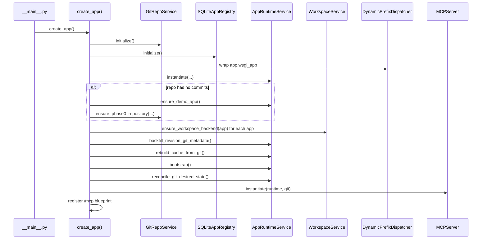
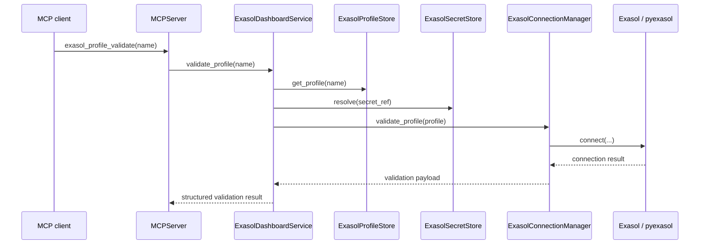
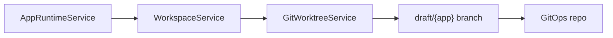
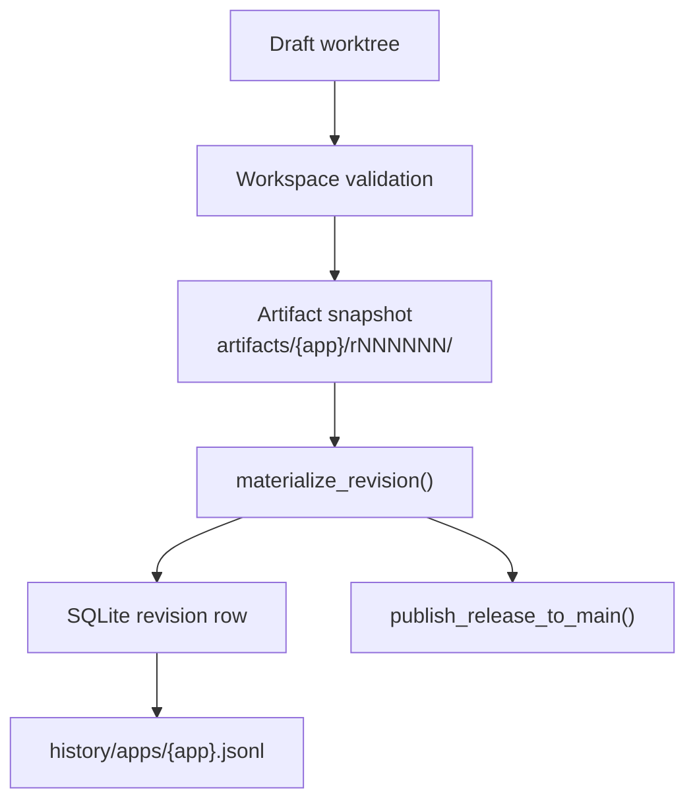
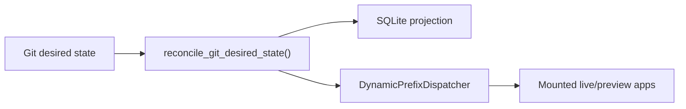
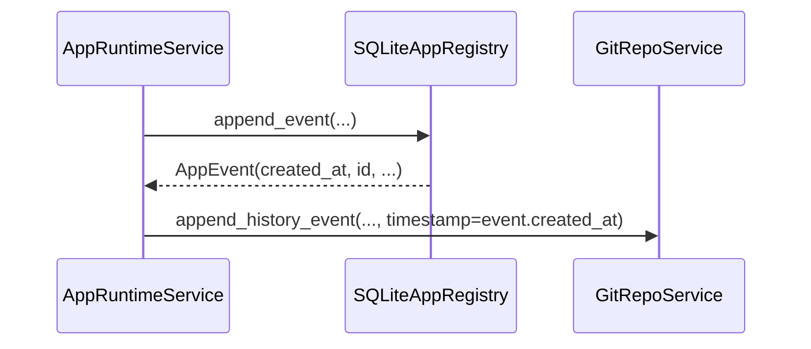

# dash-server Architecture Overview

## Purpose

`dash-server` is a Flask-based control plane for hosting multiple Dash applications behind one HTTP server, while exposing operational control through MCP at `/mcp`.

The generic hosting story still matters, but the current product direction is no longer “host arbitrary Dash apps with an MCP wrapper” in the abstract. The system is increasingly shaped around a more specific outcome:

- agents create and operate analytical Dash applications
- Exasol is the primary database-focused integration path
- credentials and durable deployment state are managed server-side rather than pushed into user prompts or ad hoc shell sessions

The current implementation is no longer primarily SQLite-centered. As of the current `phase4a` plus Exasol Phase 0 code:

- Git is authoritative for hosted app source under `apps/{name}/`
- Git is authoritative for built revision identity through release manifests and tags
- Git is authoritative for live and preview deployment intent through `desired-state/`
- Git now also carries canonical deployment audit history under `history/apps/{name}.jsonl`
- Git also carries non-secret Exasol profile metadata under `profiles/exasol/{name}.json`
- SQLite is retained as a rebuildable local projection and query index
- filesystem artifacts remain the runtime load source for mounted Dash apps
- per-app draft editing is backed by Git worktrees behind the existing workspace API
- Exasol secrets remain intentionally outside Git in environment variables or local secret files

This document is implementation-oriented. Every section below is derived from the current source tree rather than the original product plan.

## Architectural Status

The current system should be read as a GitOps-first, agent-operated modular monolith with an Exasol-specialized application path:

- one Flask process hosts the control plane
- one in-process dispatcher routes each app URL prefix either to a locally mounted Dash WSGI app or to a loopback proxy for an isolated app worker
- MCP is the structured agent control surface
- Git is the durable system of record for source, release history, desired state, and canonical deployment audit history
- SQLite is a disposable projection rebuilt from Git on startup
- Exasol profile metadata is treated as Git-tracked application configuration
- Exasol secrets are resolved locally at runtime and never committed into the repo

Runtime placement is configurable and independent from dependency placement. Local development
defaults to `shared` dependencies plus `in_process` execution. Hosted mode requires `per_app`
dependencies plus `isolated` execution unless the explicit unsafe-development override is enabled.
In isolated mode, app callbacks run in supervised subprocesses on loopback ports and the dispatcher
mounts a WSGI proxy for each app. Artifacts without a usable `app.py` currently fall back to an
in-process mount. Process isolation is operational fault isolation, not a security sandbox. See
[Runtime Modes](runtime-modes.md) for the complete matrix, lifecycle, and limitations.

## Source Map

The current architecture is concentrated in these modules:

| Module | Responsibility | Key entry points |
| --- | --- | --- |
| `src/dash_server/app_factory.py` | Composition root and startup ordering | `create_app()` |
| `src/dash_server/config.py` | Instance-path derived configuration | `Config` |
| `src/dash_server/mcp/blueprint.py` | Flask transport adapter for `/mcp` | `create_mcp_blueprint()` |
| `src/dash_server/mcp/server.py` | MCP JSON-RPC server, tools, resources, payload shaping | `MCPServer` |
| `src/dash_server/runtime/service.py` | Orchestration layer for creation, build, deploy, reconcile, diagnostics, and status | `AppRuntimeService` |
| `src/dash_server/runtime/dispatcher.py` | Dynamic path-prefix WSGI router | `DynamicPrefixDispatcher` |
| `src/dash_server/runtime/worker_manager.py` | Isolated worker lifecycle, adoption, idle-stop, restart limits, and runtime records | `AppWorkerManager` |
| `src/dash_server/runtime/worker_proxy.py` | Loopback WSGI proxy from the dispatcher to isolated app workers | `WorkerProxyWSGIApp` |
| `src/dash_server_runtime/worker/` | Minimal app-serving runtime installed in per-app environments | worker package |
| `src/dash_server/consumption/` | Registered-output contract validation, policy, shared discovery service, and read-only web adapter | `ConsumptionService` |
| `src/dash_server/registry/sqlite_registry.py` | Local projection store for apps, revisions, and events | `SQLiteAppRegistry` |
| `src/dash_server/registry/models.py` | Domain models for app, revision, exposure, and event rows | `HostedApp`, `AppRevision`, `AppEvent`, `AppManifest` |
| `src/dash_server/workspace/service.py` | Draft workspace file operations, validation, import smoke check, snapshotting | `WorkspaceService` |
| `src/dash_server/gitops/repo_service.py` | Git repository contract: releases, desired state, history, status | `GitRepoService` |
| `src/dash_server/gitops/worktree_service.py` | Per-app draft worktree management | `GitWorktreeService` |
| `src/dash_server/diagnostics/service.py` | Logs, errors, tracebacks, health/build records | `DiagnosticsService` |
| `src/dash_server/dependencies/service.py` | Lightweight dependency installation state for validation/build | `DependencyInstaller` |
| `src/dash_server/dependencies/environment_service.py` | Content-addressed per-app environments, wheel cache, and garbage collection | `DependencyEnvironmentService` |
| `src/dash_server/exasol/service.py` | Exasol profile orchestration, validation, scaffold generation, query execution | `ExasolDashboardService` |
| `src/dash_server/exasol/profiles.py` | Git-backed Exasol profile metadata storage | `ExasolProfileStore` |
| `src/dash_server/exasol/secrets.py` | Local non-Git secret resolution | `ExasolSecretStore` |
| `src/dash_server/exasol/connection_manager.py` | `pyexasol` connection creation and validation | `ExasolConnectionManager` |
| `src/dash_server/exasol/runtime.py` | Runtime helper for hosted apps to execute profile-bound SQL files | `execute_profile_query()` |
| `src/dash_server/exasol/scaffold.py` | Generated Exasol dashboard bundle and help payloads | `build_exasol_dashboard_bundle()` |
| `src/dash_server/dash_apps/factory.py` | Bundle validation and generated app scaffolds | `validate_bundle()`, schema help resources |
| `src/dash_server/dash_apps/demo.py` | Built-in demo bundle seed | `build_demo_bundle()` |
| `src/dash_server/dash_apps/runtime_checks.py` | Dash route/mount verification helpers | `verify_dash_mount()` |
| `src/dash_server/dash_apps/callback_isolation.py` | Dash global callback isolation during import/runtime loads | isolation helpers |

The most important behavioral coverage is in:

- `tests/test_mcp.py`
- `tests/test_app_factory.py`
- `tests/test_registry.py`
- `tests/test_dependencies.py`

## High-Level Model

```mermaid
flowchart TB
    User["Browser / MCP client / Git user"]

    subgraph Host["Flask Host Process"]
        Factory["create_app()"]
        MCPBP["/mcp blueprint"]
        MCP["MCPServer"]
        Runtime["AppRuntimeService"]
        Dispatcher["DynamicPrefixDispatcher"]
        Workspace["WorkspaceService"]
        Registry["SQLiteAppRegistry"]
        GitRepo["GitRepoService"]
        GitWorktrees["GitWorktreeService"]
        Diag["DiagnosticsService"]
        Deps["DependencyInstaller"]
        EnvSvc["DependencyEnvironmentService"]
        WorkerMgr["AppWorkerManager"]
        Exasol["ExasolDashboardService"]
    end

    subgraph Git["GitOps Repository"]
        AppSrc["apps/{app}/"]
        Releases["releases/{app}/rNNNNNN.yaml"]
        Desired["desired-state/live + preview"]
        History["history/apps/{app}.jsonl"]
        Profiles["profiles/exasol/{profile}.json"]
    end

    subgraph Local["Local Runtime State"]
        DB["registry.sqlite3"]
        Worktrees["workspaces/_git_worktrees/{app}/"]
        Artifacts["artifacts/{app}/rNNNNNN/"]
        Diagnostics["diagnostics/{app}/"]
        DepState["dependency_state/"]
        Environments["app_envs/ + wheels/"]
        WorkerState["workers/"]
        Secrets["exasol-secrets/{profile}.json\nor env vars"]
    end

    subgraph Isolated["Isolated Runtime Mode"]
        WorkerProxy["WorkerProxyWSGIApp"]
        AppWorkers["per-app Dash worker processes\n(loopback HTTP)"]
    end

    subgraph Mounted["Mounted Dash Apps"]
        Live["/apps/{app}"]
        Preview["/preview/{app}/{rev}"]
    end

    User -->|POST /mcp| MCPBP
    MCPBP --> MCP
    MCP --> Runtime
    Runtime --> GitRepo
    Runtime --> Registry
    Runtime --> Workspace
    Runtime --> Dispatcher
    Runtime --> Diag
    Runtime --> Deps
    Runtime --> EnvSvc
    Runtime --> WorkerMgr
    Runtime --> Exasol
    Workspace --> GitWorktrees
    GitWorktrees --> GitRepo
    Exasol --> GitRepo

    GitRepo --> AppSrc
    GitRepo --> Releases
    GitRepo --> Desired
    GitRepo --> History
    GitRepo --> Profiles

    Registry --> DB
    Workspace --> Worktrees
    Runtime --> Artifacts
    Diag --> Diagnostics
    Deps --> DepState
    EnvSvc --> Environments
    WorkerMgr --> WorkerState
    Exasol --> Secrets

    Dispatcher --> Live
    Dispatcher --> Preview
    Dispatcher --> WorkerProxy
    WorkerProxy --> AppWorkers
    WorkerMgr --> AppWorkers
    User -->|GET /apps/...| Dispatcher
```



## Composition Root

`create_app()` in `src/dash_server/app_factory.py` is the composition root and the most important place to understand dependency wiring and startup order.

### What It Instantiates

`create_app()` constructs:

- `GitRepoService`
- `GitWorktreeService`
- `SQLiteAppRegistry`
- `DynamicPrefixDispatcher`
- `DiagnosticsService`
- `DependencyInstaller`
- `DependencyEnvironmentService` when dependency isolation is `per_app`
- `AppWorkerManager` when runtime mode is `isolated`
- `ExasolDashboardService`
- `AppRuntimeService`
- `MCPServer`

It stores these in `app.extensions`:

- `dispatcher`
- `registry`
- `diagnostics_service`
- `dependency_installer`
- `exasol_dashboard_service`
- `runtime_service`
- `git_repo_service`
- `git_worktree_service`
- `mcp_server`

### Actual Startup Order

The startup sequence in code is:

1. resolve configured paths
2. initialize the GitOps repository
3. initialize the SQLite projection
4. wrap the Flask app with `DynamicPrefixDispatcher`
5. construct diagnostics, dependency, runtime, and MCP services
6. if the GitOps repo has no commits:
   - seed the built-in `demo` app into the workspace/runtime layer
   - export the initial demo state into Git
7. materialize draft worktrees/workspaces for known apps
8. backfill revision Git metadata into legacy SQLite rows
9. rebuild the SQLite projection from Git
10. mount persisted live and preview apps from the rebuilt projection, either in-process or through isolated worker proxies according to runtime mode
11. reconcile observed state to Git desired state
12. register the MCP blueprint

### Startup Sequence Diagram



This ordering matters. The system assumes Git exists first, then SQLite is repaired from Git, then runtime mounts occur from that repaired projection.

## Authority Model

The current code has a clear split between authoritative state and projected state.

### Git-Authoritative State

Git is authoritative for:

- source files under `apps/{name}/`
- revision identity through:
  - commit SHA
  - annotated tag
  - release manifest under `releases/{name}/rNNNNNN.yaml`
- desired deployment intent under:
  - `desired-state/live/{name}.yaml`
  - `desired-state/preview/{name}.yaml`
- canonical deployment audit history under:
  - `history/apps/{name}.jsonl`
- Exasol profile metadata under:
  - `profiles/exasol/{name}.json`

### SQLite Projection State

SQLite persists a local projection of:

- hosted app rows
- revision rows
- revision pointer fields used by the runtime read model
- local event rows rebuilt from Git canonical history when needed

SQLite is still actively used by the runtime and MCP read paths, but it is no longer intended to be the durable system of record.

### Filesystem Runtime State

The filesystem still holds non-Git operational state:

- draft worktree directories
- artifact directories used to load runtime code
- diagnostics files
- dependency-install state
- Exasol secrets under `instance/exasol-secrets/` when local-file mode is used

These are operational runtime resources, not the canonical control-plane record.

## Exasol-Specialized Architecture

The current product direction adds a specialized Exasol path on top of the generic Dash-hosting substrate.

The key design choice is this:

- Exasol connection metadata is server-owned configuration
- Exasol secrets are server-owned secret material
- hosted apps refer to Exasol profiles by name
- runtime query execution happens inside the server process through a shared helper path

This prevents credentials from leaking into generated source or user prompts and makes Exasol-backed apps look like a stable platform capability rather than an ad hoc code pattern.

### Exasol Components

- `ExasolDashboardService`
  - facade for profile listing, creation, validation, scaffold generation, and query execution
- `ExasolProfileStore`
  - reads and writes `profiles/exasol/*.json` in the GitOps repo
- `ExasolSecretStore`
  - resolves secrets from environment variables or local secret files
- `ExasolConnectionManager`
  - turns a profile plus resolved secret into a `pyexasol.connect(...)` call
- `dash_server.exasol.runtime.execute_profile_query()`
  - runtime helper used by generated hosted apps

### Exasol Ownership Model

Non-secret Exasol configuration belongs to Git:

- profile name
- backend
- credential mode
- DSN
- user
- TLS flag
- query defaults
- `secret_ref`

Secret values do not belong to Git:

- environment variables if `secret_ref.provider == "env"`
- local files under `instance/exasol-secrets/{name}.json` if `secret_ref.provider == "local_file"`

### Why This Matters

This split makes the Exasol path suitable for shared or multi-user environments:

- an operator can preconfigure the server once
- agents only need a profile name such as `analytics-prod`
- generated dashboards stay free of embedded credentials

### Exasol Request Path



### Exasol Dashboard Generation Path

When `app_create_exasol_dashboard` is called:

1. `MCPServer` validates tool arguments
2. `ExasolDashboardService.build_dashboard_bundle()` verifies the named profile exists
3. `build_exasol_dashboard_bundle()` generates a files-based hosted-app bundle
4. `AppRuntimeService.create_app_from_files()` creates the draft and initial revision

The generated app contains:

- `dash-app.json` with `data_sources.primary.profile`
- `app.py`
- `dash_server_exasol.py`
- `queries/overview.sql`
- `requirements.txt`

The important architectural point is that the generated app does not carry a password. It carries a profile reference.

### Exasol Runtime Path

At runtime, generated apps call `dash_server.exasol.runtime.execute_profile_query()`:

1. read the bound profile name from hosted-app metadata
2. load SQL text from `queries/*.sql`
3. resolve the profile through `ExasolDashboardService`
4. resolve the secret through `ExasolSecretStore`
5. create a `pyexasol` connection
6. execute the SQL and normalize rows/columns for Dash rendering

This means the server remains the security and integration boundary for Exasol access.

## Control Plane vs Data Plane

The product has a logical control plane and data plane. Their process placement depends on runtime mode.

| Plane | Current implementation |
| --- | --- |
| Control plane | Flask app, MCP transport, Git operations, SQLite projection rebuild/query, draft editing, validation, diagnostics |
| Data plane | Dash apps served under `/apps/...` and `/preview/...` through `DynamicPrefixDispatcher`; callbacks execute in the control-plane process in `in_process` mode or in supervised loopback workers in `isolated` mode |

`AppWorkerManager` provides per-mount worker supervision, persisted worker records, restart limits,
idle-stop, and restart/adoption behavior in isolated mode. This is not a distributed scheduler or a
container orchestrator: the control plane and workers still share one host, filesystem access, and
network boundary.

## GitOps Repository Contract

The Git repository managed by `GitRepoService` is the core storage contract.

### Repository Layout

```text
<gitops-repo>/
  .dash-server/
    repo-meta.yaml
  apps/
    <app>/
      dash-app.json
      app.py
      requirements.txt
      ...
  releases/
    <app>/
      r000001.yaml
      r000002.yaml
      ...
  desired-state/
    live/
      <app>.yaml
    preview/
      <app>.yaml
  history/
    apps/
      <app>.jsonl
  profiles/
    exasol/
      <profile>.json
```

### What Each Part Means

- `apps/{app}/`
  - authoritative source for the app as published to the main branch
- `releases/{app}/rNNNNNN.yaml`
  - immutable release metadata for each built revision
  - includes commit SHA, tag, artifact path, source hash, and dependency lock hash
- `desired-state/live/*.yaml`
  - authoritative live deployment intent
- `desired-state/preview/*.yaml`
  - authoritative preview deployment intent
- `history/apps/{app}.jsonl`
  - canonical deployment audit history used to rebuild event rows
- `profiles/exasol/{name}.json`
  - authoritative non-secret Exasol profile metadata
- `.dash-server/repo-meta.yaml`
  - repo metadata including the current architecture phase marker (`phase4a`)

### Git Status Resource

`dash://repo/status` is backed directly by `GitRepoService.status()` and currently reports:

- repository path
- initialization status
- current branch
- HEAD commit
- dirty state
- tracked apps
- live desired-state apps
- preview desired-state apps
- release tags
- history apps
- attached worktrees
- dirty worktrees
- phase marker

## Draft Editing Model

`WorkspaceService` presents a stable workspace API to the rest of the system, but its backing storage is now Git-worktree based when worktrees are available.

### Current Draft Storage

For an app `sales`, the logical draft workspace path is:

- `workspaces/_git_worktrees/sales/apps/sales/`

The worktree itself is attached to branch:

- `draft/sales`

This mapping is owned by `GitWorktreeService`.

### Why This Matters

The rest of the application still talks to `WorkspaceService` in terms of:

- put file
- patch file
- delete file
- validate workspace
- snapshot workspace

That means the Git worktree transition was done behind a stable API boundary. That is an intentional maintainability choice.

### Draft Workspace Diagram



## Revision Model

The current revision model is hybrid in implementation but Git-native in identity.

### Revision Creation

When `app_build` succeeds:

1. the draft workspace is validated
2. the workspace is snapshotted into an artifact directory
3. `GitRepoService.materialize_revision()` creates or discovers:
   - a commit SHA
   - a release tag
   - a release manifest path
4. a revision row is created in SQLite
5. `GitRepoService.publish_release_to_main()` records the release manifest on `main`, even if the revision is not yet promoted
6. a canonical `revision_built` event is appended to Git history and mirrored into SQLite

### Revision Identity Fields

`AppRevision` currently carries:

- `revision_number`
- `artifact_path`
- `source_hash`
- `dependency_lock_hash`
- `commit_sha`
- `git_tag`
- `git_branch`
- `release_manifest_path`

These fields are surfaced through MCP status and revision resources.

### Revision Flow Diagram



## Desired-State Deployment Model

The runtime no longer treats SQLite pointer fields as authoritative deployment state. Deployment intent comes from Git desired-state files, and the runtime reconciles to them.

### Live Deployment Intent

`desired-state/live/{app}.yaml` carries:

- target revision
- commit SHA
- tag
- release manifest path
- route
- visibility
- auth policy
- enabled flag
- permissions

### Preview Deployment Intent

`desired-state/preview/{app}.yaml` carries:

- target revision
- commit SHA
- tag
- release manifest path

### Write Path

The runtime writes desired state through:

- `_write_live_desired_state_for_revision()`
- `_write_preview_desired_state_for_revision()`

Both methods first publish the selected revision to `main` through `GitRepoService.publish_revision_to_main()`, then commit the desired-state change.

This is the current authoritative-branch rule:

- the selected revision must be visible from `main` before desired state points at it

## Reconciliation Model

`AppRuntimeService.reconcile_git_desired_state()` is the bridge between Git intent and observed runtime state, whether an app is mounted in-process or through an isolated worker proxy.

### What Reconcile Does

For each known app:

1. read desired live and preview state from Git
2. validate route and revision references
3. update the SQLite projection if needed
4. mount or unmount live routes in `DynamicPrefixDispatcher`
5. mount or unmount preview routes
6. surface per-app failures as structured results

### Drift Reporting

`git_drift_report()` compares:

- desired live state vs observed current revision and exposure
- desired preview state vs observed preview revision

This is exposed through `dash://repo/drift`.

### Reconcile Diagram



## Runtime Mounting

Live and preview apps are mounted by `DynamicPrefixDispatcher`.

### Live Paths

- `/apps/{app}`

### Preview Paths

- `/preview/{app}/{revision}`

### Important Runtime Detail

Mounted code comes from artifact directories, not directly from the Git worktree. That preserves the current build/deploy discipline:

- draft source is edited in worktrees
- builds create immutable artifact snapshots
- runtime mounts the artifact snapshot for a selected revision

This separation is important for later isolation and reproducibility work.

## SQLite Projection

`SQLiteAppRegistry` is still central to the current read model.

### What It Stores

- `apps`
  - name
  - title
  - route
  - status
  - exposure metadata
  - current/preview/rollback revision ids
- `app_revisions`
  - manifest
  - bundle metadata
  - lifecycle state
  - artifact path
  - Git metadata
- `app_events`
  - local event projection

### Why It Still Exists

The runtime and MCP layer currently use SQLite for:

- fast app listing
- revision lookup
- current/preview/rollback resolution
- event resources
- operational status reads

The architectural intent is not “remove SQLite immediately.” It is “make SQLite fully rebuildable from Git for canonical state.”

## Startup Recovery and Rebuild

Startup recovery is now Git-first.

### Rebuild Inputs

`rebuild_cache_from_git()` reconstructs state from:

- `apps/{name}/dash-app.json`
- `releases/{name}/rNNNNNN.yaml`
- `desired-state/live/*.yaml`
- `desired-state/preview/*.yaml`
- `history/apps/{name}.jsonl`

### Rebuild Outputs

It repopulates SQLite with:

- app rows
- revision rows
- current/preview/rollback pointer projections
- event rows when the local event table is empty

### Important Consequence

Deleting SQLite no longer destroys:

- tracked app inventory
- published and unpublished built revision inventory
- live and preview deployment intent
- canonical deployment audit history for the Git-tracked event set

It still does not mean every transient local signal belongs in Git. Diagnostics and health probe history remain operational local state.

## MCP Surface

`MCPServer` fronts the control plane and now includes both generic hosting operations and the Exasol-specific setup path.

### Main MCP Resource Families

- meta resources
  - `dash://meta/app-create-schema`
  - `dash://meta/app-create-from-files-schema`
  - `dash://meta/app-authoring-guide`
  - `dash://meta/workflows`
- GitOps resources
  - `dash://repo/status`
  - `dash://repo/desired-state`
  - `dash://repo/drift`
- Exasol resources
  - `dash://exasol/help/connection-modes`
  - `dash://exasol/profiles`
  - `dash://exasol/profiles/{name}`
- app resources
  - `dash://apps`
  - `dash://apps/{app}`
  - `dash://apps/{app}/status`
  - `dash://apps/{app}/manifest`
  - `dash://apps/{app}/revisions`
  - `dash://apps/{app}/events`
  - workspace, diff, diagnostics, log, health, and dependency resources

### Main Tool Families

- repository
  - `repo_reconcile`
- Exasol
  - `exasol_profiles_list`
  - `exasol_profile_create_local`
  - `exasol_profile_validate`
  - `app_create_exasol_dashboard`
- creation and deployment
  - `app_create`
  - `app_create_from_files`
  - `app_build`
  - `app_deploy_draft`
  - `app_start_preview`
  - `app_promote_revision`
  - `app_rollback`
- runtime
  - `app_start`
  - `app_stop`
  - `app_restart`
  - `app_get_status`
- source management
  - `app_put_files`
  - `app_patch_file`
  - `app_delete_file`
  - `app_validate`
- diagnostics
  - `app_collect_diagnostics`
  - `app_inspect_traceback`
  - `app_tail_logs`
  - `app_run_healthcheck`

### MCP Layering Rule

The MCP server remains intentionally thin:

1. parse JSON-RPC
2. validate arguments
3. call runtime or Git read model
4. return text plus `structuredContent`

Business logic stays in `AppRuntimeService` and `GitRepoService`, not in the transport adapter.

For the Exasol path, business logic also stays out of the MCP layer:

- profile operations live in `ExasolDashboardService`
- connection details live in `ExasolConnectionManager`
- secret resolution lives in `ExasolSecretStore`

## Canonical Event History

The current architecture now has two event layers:

### Canonical History in Git

`history/apps/{app}.jsonl` records the durable event subset that matters for deployment history:

- `app_seeded`
- `app_created`
- `revision_built`
- `preview_started`
- `preview_cleared`
- `revision_promoted`
- `rolled_back`

These are appended through `_append_canonical_event()` in `AppRuntimeService`.

### Local Event Projection in SQLite

SQLite still stores `app_events`, but this is now treated as a rebuildable mirror for the canonical subset. Startup backfills Git history from existing SQLite rows during migration and rebuilds SQLite event rows from Git when the DB is missing.

### Event Flow



This preserves the current API shape while moving canonical durability into Git.

## Diagnostics and Health

Diagnostics remain filesystem-backed and local.

`DiagnosticsService` stores:

- build results
- runtime logs
- captured errors
- parsed tracebacks
- callback failure records

These are intentionally not part of the GitOps authority model. They are operational observations, not desired state.

Health checks in `AppRuntimeService` probe mounted live and preview routes and verify that a Dash shell, layout, and static asset references are actually reachable.

## Dependency Handling

Dependency placement has two modes:

- `shared` uses `DependencyInstaller` and the server interpreter. This is the local-development default.
- `per_app` uses `DependencyEnvironmentService` to create content-addressed environments from app requirements, reuse identical environments, maintain a wheel cache, and garbage-collect unused environments. This is required in hosted mode unless the unsafe-development override is enabled.

Dependency isolation and runtime isolation are orthogonal. A per-app environment can be used for
subprocess validation while callbacks remain in-process, although hosted mode normally combines
`per_app` with `isolated`. See [Runtime Modes](runtime-modes.md).

For Exasol-backed apps specifically:

- the control-plane environment must have `pyexasol` available for profile validation and in-process query execution
- generated Exasol apps declare `pyexasol` in `requirements.txt`, which also makes it available in their per-app environments
- in `in_process` mode, runtime queries execute through the control-plane service
- in `isolated` mode, the worker constructs its own profile/query service from the GitOps repository and external secrets root, so query callbacks execute in the worker process

## Security and Isolation Boundary

The persisted exposure model includes:

- route
- visibility
- auth policy
- enabled flag
- permissions object

Those settings are stored in desired state and mirrored into SQLite. Isolated runtime mode provides
a per-app OS process and prevents an ordinary app crash from directly taking down the control plane
or another worker. It does not provide a security sandbox: workers inherit the server user's
filesystem and network access, and there is no container, seccomp, resource-limit, or egress-policy
boundary yet.

Architecturally, the permissions model is currently declarative state plus routing/publication behavior, not a hardened execution boundary.

## Current Strengths

- Git is now the durable operational truth for source, revisions, desired state, and canonical deployment audit history
- startup recovery is materially Git-first
- MCP and direct Git edits converge through the same desired-state model
- draft editing is Git-backed without exposing Git mechanics to the rest of the application
- SQLite remains useful as a local read model while no longer being the primary system of record
- Exasol integration is now a first-class control-plane capability rather than a prompt-only convention
- Exasol credentials can be owned server-side while generated apps stay credential-free

## Current Limitations

- isolated workers share the control-plane host and are not security sandboxes
- artifacts without a usable `app.py` fall back to in-process serving even when isolated mode is selected
- artifacts, not Git checkouts, are the runtime execution source
- diagnostics are local only and not reconstructible from Git
- per-app environments and worker state are local filesystem facilities rather than distributed services
- Exasol is still Phase 0 in depth: no richer schema discovery, no hosted multi-user auth propagation, and no OS-keychain secret backend yet
- there is no remote sync, webhook reconcile, branch protection integration, or signed-release flow yet

## Extension Seams

The current codebase is already set up for further evolution in a few clear places:

- replace host-level process isolation with a pluggable sandbox/container launcher and enforce resource and network policy
- move environment, artifact, and worker lifecycle coordination from local-only state to production-grade shared infrastructure where horizontal scaling requires it
- extend `GitRepoService` for remote push/pull and sync policy
- preserve MCP as a control surface while allowing Git to remain a first-class operator interface
- keep SQLite as a disposable projection or replace it later with a different query index

## Practical Reading Guide

For a maintainer or architect, the fastest path through the real implementation is:

1. `src/dash_server/app_factory.py`
   - understand startup order and dependency graph
2. `src/dash_server/runtime/service.py`
   - understand orchestration, desired-state writes, reconcile, rebuild, and status serialization
3. `src/dash_server/gitops/repo_service.py`
   - understand the repository contract and what is Git-authoritative
4. `src/dash_server/workspace/service.py`
   - understand draft editing, validation, and worktree-backed source management
5. `src/dash_server/mcp/server.py`
   - understand how the public MCP surface maps to the orchestration layer
6. `src/dash_server/exasol/service.py`
   - understand how Exasol profiles, secrets, validation, scaffolds, and runtime query execution are modeled

That set of files is the actual architectural center of gravity in the current codebase.
